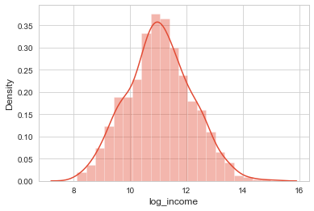

# HIV_Forecast


## Goal

* To accurately model HIV incidences (new infections per 100,000) in US counties by building a linear regression model that utilizes HIV infection data, census data, data on the opioid crisis, and data on sexual orientation.

* Identify features that are the most significant drivers of HIV infection rates and learn how these drivers differ between different regions.

## Background

Due to the development of anti-retroviral therapies the HIV/AIDS epidemic is generally considered to be under control in the US. However, as of 2015 there were 971,524 people living with diagnosed HIV in the US with an estimation of 37,600 new HIV diagnoses in 2014. HIV infection rates continue to be particularly problematic in communities of color, among men who have sex with men (MSM), the transgender community, and other vulnerable populations in the US. Socioeconomic factors are a significant risk factor for HIV infection and likely contribute to HIV infection risk in these communities. The current US opioid crisis has further complicated the efforts to combat HIV with HIV infection outbreaks now hitting regions that weren’t previously thought to be vulnerable to such outbreaks.

A model that can accurately forecast regional HIV infection rates would be beneficial to local public health officials. Provided with this information, these officials will be able to better marshal the resources necessary to combat HIV and prevent outbreaks from occurring. Accurate modeling will also identify risk factors for communities with high HIV infection rates and provide clues as to how officials may better combat HIV in their respective communities.

## Dataset
Merged dataset of 3140 rows x 39 columns. Year of 2015.
## Features Choosing 
Most of the columns names are professional medical terms. Here is the list for better understanding.
\
<br>

\
<br>
Corelation matrix shows that HIV incidences isn't correlated much with other features.

\
<br>
Corelation for HIV incidence and other featurs in a descending order. 


\
<br>

## Regression Model
Based on the initial Correlation Matrix and Scatter plot the strongest correlation with Incidence was prevalence but still not too big of a number.
Based on this, domain research and a lot of trial and error we picked our features:
\
<br>
```'HIVprevalence', 'poverty_rate','household_income', 'num_SSPs', 'pctunins'```

\
<br>
In the first step we built an OLS model with all the features and only picked the ones that had the lowest p_values and were not highly correlated with each other.
Then ran a k-fold cross validation on train data and test data. Our error metric(RMSE) was very low on the test set and very high on the train set which was odd.  
\
<br>
After looking back at the target (HIV incidents), turns out there is an outlier that we did not consider in the beginning. 

\
<br>
Scott county, IN due to an HIV out break in 2015, had 771 HIV incidences per 100,000 people wich is 192 times more than average (average is 4.04 per 100,000)
We had to take that out of the data set and start again.
This time we got better results comparing RMSE of traning set and testing set.
\
<br>

\
<br>
Poverty was taken out because of the P-value of 0.433 and house_holdincome got transformed to Log of income. 
num_SSPs is categorical so we didn't include that in our next model. 
\
<br>



\
<br>
3 models were built :OLS , Ridge and Lasso.
Out of all the 3 OLS has the best results where the R-Squared is 0.63, RMSE on training set is 7.4 and on test set is 8.3.
\
<br>


\
<br>


## Future
- Removing rows where HIV data was suppressed resulted in over 70% reduction in usable data.
- Better HIV Collection Statistics
- More accurate HIV collection data could expand counties explored, specifically greater than ~750.
- Include valid hotspots/outbreaks | ie. Scott County Indiana and likewise.
